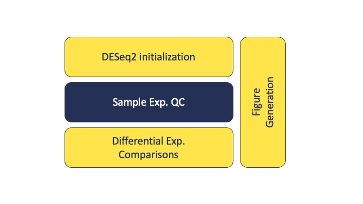

<!--- Allow the page to be wider --->
<style>
    body .main-container {
        max-width: 1200px;
    }
</style>

> # Objectives
> * Discuss count normalizations
> * Execute model fitting for differential expression comparisons


# Differential Expression Workflow

{width=75%}

Here we will proceed with count normalizations and fit our DESeq2 model.

| Step | Task |
| :--: | ---- |
| 1 | Experimental Design |
| 2 | Biological Samples / Library Preparation |
| 3 | Sequence Reads |
| 4 | Assess Quality of Raw Reads |
| 5 | Splice-aware Mapping to Genome |
| 6 | Count Reads Associated with Genes |
| :--: | ---- |
| 7 | Organize project files locally |
| **8** | **Initialize DESeq2 and fit DESeq2 model** |
| 9 | Assess expression variance within treatment groups |
| 10 | Specify pairwise comparisons and test for differential expression |
| 11 | Generate summary figures for comparisons |
| 12 | Annotate differential expression result tables |

---

# Count normalizations

Since counts of mapped reads for each gene is proportional to the expression of RNA in addition to many “uninteresting” other factors, normalization is the process of scaling raw count values to account for the “uninteresting” factors and ensure expression levels are more comparable.

## Normalization goals

Two common factors that need to be accounted for during normalization are **sequencing depth** and **gene length**. Common normalization approaches (such as FPKM, RPKM, CPM, TPM, etc.) account for one or both of these factors.    

* **Sequencing depth** normalization is neccessary to account for the proportion of reads per gene expected for more deeply sequenced samples (like in pink below) versus a less deeply sequenced sample (like in green below).    

*](./images/normalization_methods_depth.png)    

    
* **Gene length** normalization is necessary since genes of different lengths have different probablities of generating fragments that end up in the library. In the example below, both genes have similar levels of expression. However, the number of reads that map to the longer gene (Gene X) will be much great than the number of reads that map to the short gene (Gene Y).    

*](./images/normalization_methods_length.png)      
    
> **Note**: The above figures are originally from a [HBC  tutorial](https://hbctraining.github.io/DGE_workshop/lessons/02_DGE_count_normalization.html) that also includes a detailed comparison of different normalization (CPM, TPM, FPKM) approaches and their best uses.

## DESeq2 normalizations

An additional consideration for normalization is **RNA composition**. A few highly differentially expressed genes, differences in the number of genes expressed between samples, or contamination are not accounted for by depth or gene length normalization methods. Accounting for RNA composition is particularly important for differential expression analyses, regardless of the tool used.

DESeq2 has an [internal normalization process](https://genomebiology.biomedcentral.com/articles/10.1186/gb-2010-11-10-r106). However for data exploration and visualizations, it is helpful to generate an object of independently normalized counts.

For downstream sample level quality control visualizations, we will use the [rlog transformation](http://bioconductor.org/packages/devel/bioc/vignettes/DESeq2/inst/doc/DESeq2.html#count-data-transformations) that accounts for sequencing depth for each sample and RNA composition differences in the overall experiment.

The rlog transformation produces log2 scale data that has also been normalized to overall library size as well as variance across genes at different mean expression levels. For larger numbers of samples, there is an alternative transformation method, [vst](http://www.bioconductor.org/packages/release/bioc/vignettes/DESeq2/inst/doc/DESeq2.html#count-data-transformations) that can be used instead for count normalizations. 

The command to generate the normalized count object has a few parts, including `dds` as an input and providing a value to the option `blind`.

```r
rld <- rlog(dds, blind = TRUE)
```

```
## -- note: fitType='parametric', but the dispersion trend was not well captured by the
##    function: y = a/x + b, and a local regression fit was automatically substituted.
##    specify fitType='local' or 'mean' to avoid this message next time.
```


Next, we'll look at the results of the tranformation.

```r
head(assay(rld), 3)
```

```
##                    Sample_116498 Sample_116499 Sample_116500 Sample_116501
## ENSMUSG00000000001     12.639049     12.609976     12.791192     12.619063
## ENSMUSG00000000028      7.847671      8.152787      7.949574      8.203993
## ENSMUSG00000000031      1.489351      1.601985      1.606559      1.457147
##                    Sample_116502 Sample_116503 Sample_116504 Sample_116505
## ENSMUSG00000000001     12.721280     12.668801     12.531667     12.507981
## ENSMUSG00000000028      8.464987      8.506084     10.825518     10.897101
## ENSMUSG00000000031      1.619475      1.413016      2.052145      1.854749
##                    Sample_116506 Sample_116507 Sample_116508 Sample_116509
## ENSMUSG00000000001     12.475655     12.727173     12.513630     12.469952
## ENSMUSG00000000028     11.006593     11.159956     11.067216     11.094892
## ENSMUSG00000000031      1.621772      1.552014      2.035164      2.322059
```

Looking at the rld values, we can see that they are now in log scale. Since we set `blind=TRUE`, the transformation is blind to the sample information we specified in the design formula. The normalized counts are helpful for visualization methods during expresion-level quality assessment but **aren't used in the model fitting**. 

# DESeq2 Model Fitting

Next, we'll fit our standard model using the `DESeq` function and take a look at the objects we generate. 

```r
dds <- DESeq(dds)
```

This command applies the model to our data, using the sample information supplied when generating the `dds` object so it takes some time to run. 


```r
resultsNames(dds)
```

```
## [1] "Intercept"                    "Gtype.Tx_ko.Tx_vs_wt.Tx"     
## [3] "Gtype.Tx_ko.control_vs_wt.Tx" "Gtype.Tx_wt.control_vs_wt.Tx"
```

The results include three pairwise comparisons to the specified control as default but other information is now stored in the `dds` object so we can generate additional pairwise comparisons.


```r
head(dds)
```

---

[Optional Exercise]

If you executed the commands in the option exercise from Module 07, you can fit a seperate DESeq2 model for the patient sample example, which included a covariate in our model. 

```r
dds_patient <- DESeq(dds_patient)
```

```r
resultsNames(dds_patient)
```


If you run through the optional exercises, you can explore the impact of adding a covariate by substituting `dds_patient` for `dds` and re-running those commands since both DESeq2 objects have their data organized in the same way.

---

**Checkpoint**: *If you see the same results when you execute `resultsNames(dds)`, please indicate with the green 'yes' button. Otherwise, please use the 'red x' button to get help before the break*


**Before moving on with our group comparisons, we'll take a short (10 minute) break.**

---

# Sources
## Training resources used to develop materials
* HBC DGE setup: https://hbctraining.github.io/DGE_workshop/lessons/01_DGE_setup_and_overview.html
* HBC Count Normalization: https://hbctraining.github.io/DGE_workshop/lessons/02_DGE_count_normalization.html
* DESeq2 standard vignette: http://bioconductor.org/packages/devel/bioc/vignettes/DESeq2/inst/doc/DESeq2.html
* DESeq2 beginners vignette: https://bioc.ism.ac.jp/packages/2.14/bioc/vignettes/DESeq2/inst/doc/beginner.pdf
* Bioconductor RNA-seq Workflows: https://www.bioconductor.org/help/course-materials/2015/LearnBioconductorFeb2015/B02.1_RNASeq.html


These materials have been adapted and extended from materials listed above. These are open access materials distributed under the terms of the [Creative Commons Attribution license (CC BY 4.0)](http://creativecommons.org/licenses/by/4.0/), which permits unrestricted use, distribution, and reproduction in any medium, provided the original author and source are credited.
