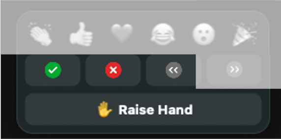
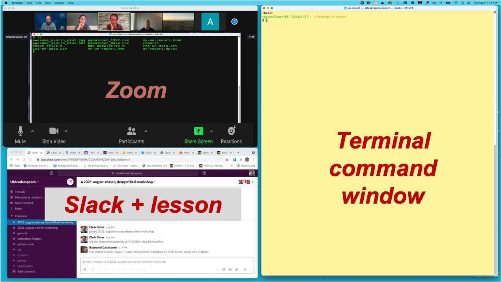

# Welcome to RNA-Seq Demystified

## About us

- Chris Gates cgates@umich.edu
- Marci Brandenburg mbradenb@umich.edu
- Dana King damki@umich.edu
- Travis Saari trsaari@umich.edu
- Helpers

## A brief word from our sponsors

- [University of Michigan Library](https://www.lib.umich.edu/)

  Our mission is to support, enhance, and collaborate in the instructional, research, and
  service activities of faculty, students, and staff, and contribute to the common good by
  collecting, organizing, preserving, communicating, sharing, and creating the record of human
  knowledge.

- [Biomedical Research Core Facilities](https://brcf.medicine.umich.edu/)

  Biomedical Research Core Facilities (BRCF) helps researchers economically take advantage of
  the latest technology and collaborate with top experts in the field. Established in 1986, the
  BRCF was formed to offer centralized access to research services and equipment.

## About the BRCF Bioinformatics Core

- The UM Bioinformatics Core is a team seven analysts; we help researchers **design, analyze,
  and interpret** high-throughput genomics experiments.
- Last year we helped about 60 researchers design and execute about 100 projects across:
    - gene expression
    - variant calling, copy-number analysis
    - chromatin accessibility and binding
    - DNA methylation
    - single-cell experiments
    - custom bioinformatic analyses
- We provide letters of support for grant proposals.
- We are also creating a series of bioinformatics-focused workshops

## About this workshop

- By the end of the workshop, attendees will be able to
  - Transform raw sequencing data into annotated differential expression values using a suite of
    open-source tools.
  - Identify common data quality problems and understand their impact and possible mitigations
  - Visualize differential expression data in RStudio plots.

- This workshop is targeted toward researchers who would like to be able to run RNA-Seq analysis on their
  own. It assumes a very basic familiarity with genetics, the command line, and R or R-Studio.

- The first day will be a mix of hands-on content and lecture-style components, while the second
  day will primarily be a hands-on experience.

- Please let us know if there is anything we can do to improve the workshop experience.

- Our purpose is not to be exhaustive, there is a lot that we cannot cover in
  the allotted time, and we don't expect anyone to be an expert at the end of
  the workshop. But we hope you will have a familiarity with key concepts, data types,
  tools, and how they all connect to one another in the service of a biological question.

# Housekeeping

## Code of Conduct (CoC)

- Be kind to others. Do not insult or put down others. Behave professionally. Remember that
  harassment and sexist, racist, or exclusionary jokes are not appropriate for the workshop.

- All communication should be appropriate for a professional audience including people of many
  different backgrounds. Sexual language and imagery is not appropriate.

- The Bioinformatics Core is dedicated to providing a harassment-free community for everyone,
  regardless of gender, sexual orientation, gender identity and expression, disability, physical
  appearance, body size, race, or religion. We do not tolerate harassment of participants in any
  form.

- Thank you for helping make this a welcoming, friendly community for all.

- If you have questions about the CoC please reach out to the hosts during the workshop, or
  email us at bioinformatics-workshops@umich.edu.

- To report a CoC incident/concern, please email Chris Gates (Bioinformatics Core, Managing
  Director) at cgates@umich.edu or contact the University of Michigan Office of Institutional
  Equity at institutional.equity@umich.edu.

## Workshop patterns, Zoom controls, and using Slack

- We will be recording this session. Recordings will be available to participants following
  the workshop.

#### Using 

- Zoom controls are at the bottom of the Zoom window:

- To minimize distractions, we encourage participants to keep their audio muted (1) (unless
  actively asking a question).
- To maximize engagement, we encourage participants to keep their video on.
- Zoom's "non-verbal controls" are a useful way to interact
  - Depending on your version of Zoom you can access these either
    - in the **Reactions** button on you main Zoom window
    - at the bottom of the **Participant** pane

  - **Raise Hand** to request clarification or ask a question. (Same an in-person workshop.)
  - **Green check [Ok!]** when you complete an assigned task or for other
    feedback specified by instructor
  - **Gray chevron [Give me a sec]** when you need more time to complete
    an exercise or you would like the instructor to repeat an idea
    - **Red "X" [I need help]** to request assistance from helper
      - Hosts will connect you with a helper in a breakout room.

#### Using 

- **Slack** can be used to communicate to the group or to individuals.

  - Slack messages will be posted to the **rsd-workshop-general** channel.  
    Click on the channel in the left pane (1) to select this channel.
  - You can type in the **message field** (2); click **send** (3) to
    post your message to everyone.
  - You can respond in a message thread by hovering over a message to trigger
    the message menu and clicking the speech bubble (4).

#### Arranging you screens
It is vital that you can see:
 - Zoom (instructor's shared screen + reactions)
 - Slack
 - Your terminal/command window (day 1) or R/Studio (day 2)

#### Communication patterns
| |  |  |
|-|:-:|-|
| "Yep - I got it" |  | |
| "I need to you repeat that last part" |  | |
| "I have an urgent question" |  -or-  | **post a question** |
| "I have a general question" | | **post a question** |
| "I'm stuck / I need a hand" |  | **request a breakout** |

### Breakout Rooms

 - We're all going to be transported into randomized breakout rooms to see what that's like.
 - Introduce yourself and share a reason you signed up for this workshop.
 - When you have completed introductions, you can leave the breakout room to rejoin the main room.

### Schedule

### Any questions?
 -
 -

---

* This workshop content is licensed under a [Creative Commons Attribution 4 License](https://creativecommons.org/licenses/by/4.0/).

* The workshop Code of Conduct has been adapted the NumFocus Code of Conduct (https://numfocus.org/code-of-conduct) which itself draws frin from numerous sources, including the Geek Feminism wiki, created by the Ada Initiative and other volunteers, which is under a Creative Commons Zero license, the Contributor Covenant version 1.2.0, the Bokeh Code of Conduct, the SciPy Code of Conduct, the Carpentries Code of Conduct, and the NeurIPS Code of Conduct.

* Sections of the workshop content have been adapted and extended from materials created by the [Harvard Chan Bioinformatics Core (HBC)](http://bioinformatics.sph.harvard.edu/). These are open access materials distributed under the terms of the [Creative Commons Attribution license (CC BY 4.0)](http://creativecommons.org/licenses/by/4.0/), which permits unrestricted use, distribution, and reproduction in any medium, provided the original author and source are credited.

* "File:Bicycle diagram-en.svg" by Al2 is licensed under CC BY 3.0
